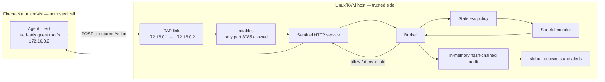

# Deterministic Sentinel — AI-swarm containment PoC

A standard-library Python proof of concept for a deterministic guard around an
AI-agent swarm. Agents propose typed actions; a trusted sentinel applies
capabilities, budgets, taint tracking, and cross-agent correlation before
returning an allow or deny decision with the rule that fired. Decisions depend
on the action, configured rules, and accumulated state; no LLM decides permission.

The repository includes four ways to exercise the same broker:

- **Local demo:** six scripted agents and abstract attack scenarios run in one
  Python process. No microVM or live model is started.
- **Live NVIDIA Nemotron demo:** six agents request model proposals from NVIDIA,
  then submit abstract tool calls to the local deterministic sentinel.
- **Local HTTP smoke test:** a separate agent process submits action records to
  the sentinel service.
- **Firecracker deployment:** an unprivileged guest client submits records to
  a sentinel on the Linux/KVM host through a restricted TAP interface.

An allowlist alone cannot detect every misuse of a permitted destination. This
PoC adds stateful checks to demonstrate how a broker can block those patterns.

> **Safety note.** Action requests perform no real file, tool, or outbound
> network effects and contain no exploit. The live demo makes real HTTPS requests
> to NVIDIA for model proposals. The microVM launcher configures a
> local TAP/firewall, and the agent sends action records to the host sentinel.
> The "attacks" remain abstract action records, not working attack code.

## Architecture



The guest has one network interface and no default route. The host firewall
drops guest traffic except requests to the sentinel. The broker first applies
the per-action policy, then the stateful monitor, and returns a named rule with
every decision. An `allow` is only a decision: this PoC has no trusted adapter
that performs the requested file, tool, DNS, or outbound network effect.

The sentinel prints audited decisions and escalation alerts to stdout. The
audit chain lives in memory and is lost when the process exits. The boot test
captures host and guest console output in a temporary file, prints it on
failure, and deletes it on exit; there is no persistent log store yet.

## Layers

| Layer | File | Job |
|---|---|---|
| Action vocabulary | `sentinel/actions.py` | Agents touch the world only via typed `Action`s (a finite action calculus). No raw sockets/files/subprocess. |
| Deterministic policy | `sentinel/policy.py` | Allow/deny of a single action in isolation. Default-deny, per-agent capabilities, exact-host allowlists, canary paths. Outside the model. |
| Stateful monitor | `sentinel/monitor.py` | What the policy can't see: cumulative **budgets** (per-agent **and** per-swarm), **taint** tracking, **provenance**, **swarm correlation**. Can only make a decision *stricter*. |
| Broker | `sentinel/broker.py` | The single enforcement point. Complete mediation: policy → monitor → allow/deny, with fail-closed handling and an audit log. |
| Response policy | `sentinel/response.py` | Maps denied rules to deny-only, agent blocking, or swarm quarantine; emits escalation alerts. |
| Agent interface | `swarm/ai_agents.py`, `swarm/catalog.py` | Six agent roles, a scripted model backend, and six tools that submit abstract actions. |
| Live model backend | `swarm/nemotron.py`, `swarm/live_demo.py` | NVIDIA Nemotron proposes calls; the local sentinel decides permission. |
| HTTP front end | `sentinel/serve.py` | Same broker as a stdlib HTTP service on the Linux host. |

## What it catches (and how)

| Pattern | Check | Rule that fires |
|---|---|---|
| Send secret straight out | destination allowlist | `egress-allowlist` |
| Abuse the one *permitted* host | cumulative outbound budgets | `budget-agent` / `budget-swarm` |
| read → transform → send to an **allowlisted** host | inherited taint through provenance | `taint-egress` |
| Smuggle bytes in DNS names | covert channel | `dns-allowlist` |
| Agent A probes, agent B sends | multi-agent split role | `corr-split-role` |
| N agents each send a slice | distributed exfiltration / collusion | `corr-split-payload` |
| Touch a honeytoken | canary tripwire | `canary-tripwire` (hard kill) |

## What happens on detection

Detection and *response* are separated so the reaction is a reviewed setting
(`sentinel/response.py`), not hard-coded. A deny always blocks the action first;
on top of that, a `ResponsePolicy` maps the rule that fired to an escalation:

| Mode | Effect |
|---|---|
| `DENY_ONLY` | block this action; the agent keeps operating |
| `KILL_AGENT` | block + permanently deny every future action from this agent |
| `QUARANTINE_SWARM` | block + deny future broker actions from every agent (`swarm-quarantined`) |

Any escalation also emits an `Alert` to an out-of-band sink (a human/SIEM) — in
the demo it prints `!! ALERT [...]`. Two presets: `ResponsePolicy.preserve_original()`
(taint/canary kill the agent) and `ResponsePolicy.strict()` (a confirmed leak
quarantines on taint, canary, and split-payload detections; split-role kills the
sending agent). The local demo uses the original preset, then demonstrates the
strict preset separately. The HTTP service uses the strict preset.

These responses change broker state; they do not terminate processes or stop
the VM. There is no review or resume endpoint.

The audit log is **hash-chained** (`AuditLog`): each entry commits selected
action and decision fields to the previous hash. `audit.verify()` detects
changes to those committed fields. It is in memory only; durable, out-of-band
storage would be needed for a production audit trail.

## Quick start

Use Python 3.13. The demo and direct test runner need no third-party packages,
API credentials, root privileges, or KVM. Run from the repository root:

```bash
cd sentinel-poc
python3.13 run_demo.py        # swarm demo + response-on-detection + chain verify
python3.13 test_sentinel.py   # 19 tests  (or: pytest)
```

The demo should finish with `ALL SCENARIOS BEHAVED AS EXPECTED`,
`total actions: 15   denied: 7`, and a successful audit-chain verification.
The direct test runner should report `19/19 tests passed`. Split-payload and
strict-response examples use separate brokers from the 15-action summary.

### Live NVIDIA Nemotron demo

Create `.env` in the repository root (beside this README) with your NVIDIA API
key. The live backend automatically loads it, regardless of the working directory:

```dotenv
NVIDIA_API_KEY=your-nvidia-api-key
NVIDIA_MODEL=nvidia/nemotron-3.5-lightning-30b-a3b
NVIDIA_BASE_URL=https://integrate.api.nvidia.com/v1
LOG_LEVEL=INFO
```

| Setting | Behavior |
|---|---|
| `NVIDIA_API_KEY` | Required for the live demo. |
| `NVIDIA_MODEL` | Defaults to `nvidia/nemotron-3.5-lightning-30b-a3b`; must start with `nvidia/nemotron-`. |
| `NVIDIA_BASE_URL` | Defaults to `https://integrate.api.nvidia.com/v1`; must use HTTPS. The backend appends `/chat/completions`. |
| `LOG_LEVEL` | Defaults to `INFO`; accepts `DEBUG`, `INFO`, `WARNING`, `ERROR`, or `CRITICAL`. |

The default is [Nemotron 3.5 Lightning 30B A3B](https://build.nvidia.com/nvidia/nemotron-3.5-lightning-30b-a3b/build).
The earlier `nvidia/nemotron-nano-3-30b-a3b` setting returned HTTP 404.
The corrected older ID, `nvidia/nemotron-3-nano-30b-a3b`, returns HTTP 410;
NVIDIA reports that it reached end of life on September 1, 2026.

Existing shell environment variables take precedence over `.env`. The file is
ignored by Git, and the key is used only by the model transport.

Run from the repository root:

```bash
cd sentinel-poc
python3.13 -m swarm.live_demo
```

To supply a task or override the configured model:

```bash
python3.13 -m swarm.live_demo \
  --model nvidia/nemotron-3.5-lightning-30b-a3b \
  --task "Produce a short result for the sandbox demo"
```

The demo makes one NVIDIA request per role and validates all six proposals before
submitting any tool calls. Each proposal contains one to six calls. The sentinel
then prints an `ALLOW` or `DENY` decision and rule for each abstract action,
followed by action counts and `audit chain verifies: True` on success.

Requests use JSON response mode, disable thinking, and cap output at 2048 tokens.
The prompt assigns a tool to each role and specifies empty arguments for
`run_python`; generated proposals still undergo strict local validation.
Requests have a 60-second timeout, with no retries or provider fallback. Missing
credentials, request failures, or invalid proposals stop the demo with exit code 1
before any tool calls are submitted. The live demo runs in a local Python process;
the Firecracker client continues to use its three-action smoke test.

Verification on October 3, 2026: all 19 offline tests and the local demo
passed. The replacement accepted live requests, but checks encountered an
incomplete response, malformed JSON, and provider timeouts. The final live
run timed out before submitting actions; a successful six-agent live run
has not yet been verified.

### Local HTTP smoke test

In one terminal, start the sentinel bound to loopback:

```bash
cd sentinel-poc
SENTINEL_BIND=127.0.0.1:8085 python3.13 -m sentinel.serve
```

In another terminal, submit the three smoke-test actions:

```bash
cd sentinel-poc
BROKER_URL=http://127.0.0.1:8085/submit python3.13 -m swarm.agent_client
```

Expect an allowed read, an allowed send to `api.internal.svc`, and a denied send
to `drop.attacker.example` with rule `egress-allowlist`. Stop the server with
Ctrl-C when finished. `SENTINEL_BIND` defaults to `0.0.0.0:8085`;
`BROKER_URL` defaults to the microVM endpoint `http://172.16.0.1:8085/submit`.

The service accepts JSON at `POST /submit` with `agent_id`, `type`, `params`,
and optional `derived_from` action IDs. It returns `allow`, `rule`, and `reason`.
Malformed action bodies return a deny with `fail-closed`; an unknown endpoint
returns HTTP 404. Valid submissions receive HTTP 200 even when denied, so
clients must inspect `allow`.

## Six AI agents and six tools

The local demo now creates six `AIAgent` instances with distinct roles:
researcher, writer, analyst, reporter, resolver, and coordinator (`agent-1`
through `agent-6`). The HTTP service grants the same six identities.

| Tool | Sentinel action |
|---|---|
| `read_file` | `file_read` |
| `write_file` | `file_write` |
| `run_python` | `tool_exec` (python only) |
| `send_result` | `net_send` |
| `resolve_host` | `dns_resolve` |
| `publish_message` | `bus_publish` |

`swarm/ai_agents.py` provides the model interface and tool registry. Every tool
call goes through `Broker.submit`, including provenance supplied in
`ToolCall.derived_from`. Tools submit abstract intents and do not execute real
effects. The six tools wrap the existing action vocabulary; only `python` is
an allowed tool binary.

The default `OfflineModel` is a scripted simulation, **not a live LLM**. To
integrate a model, implement `propose(role, task) -> list[ToolCall]` and pass
that backend to `build_ai_agents(model)`. The model proposes actions; the
sentinel remains deterministic and retains sole authority to allow or deny.
The optional live backend uses NVIDIA Nemotron for model proposals. The
microVM client still runs its existing three-action mediation smoke test.

## Firecracker microVM deployment

This deployment needs a **Linux host with KVM** and the Firecracker binary. It
cannot boot directly on macOS. Obtain a compatible guest kernel image from the
[Firecracker releases](https://github.com/firecracker-microvm/firecracker/releases)
for the host architecture. On a Debian/Ubuntu Linux host, install `debootstrap`,
`e2fsprogs`, `iproute2`, `nftables`, and `coreutils`, plus Python 3.13 on the host, then
build a Debian Trixie guest image:

```bash
cd sentinel-poc
sudo deploy/microvm/build-rootfs.sh /path/to/agent.ext4
sudo KERNEL_IMAGE=/path/to/vmlinux ROOTFS_IMAGE=/path/to/agent.ext4 \
  deploy/microvm/run.sh
```

To run the boot integration test on that Linux/KVM host, build a fresh guest
image from the current source, then run:

```bash
cd sentinel-poc
sudo KERNEL_IMAGE=/path/to/vmlinux ROOTFS_IMAGE=/path/to/agent.ext4 \
  deploy/microvm/test-boot.sh
```

The test boots the guest, waits up to 120 seconds, and checks that two benign
actions were allowed and an external-host send was denied by
`egress-allowlist`. The guest prints `SENTINEL_BOOT_TEST_PASS` only after all
three responses match. The test exits 77 with `SKIP` on hosts without Linux
KVM. The local Python demo and tests do not verify guest boot or firewall enforcement;
run this integration test separately on the target Linux/KVM host.

The rootfs builder downloads Debian packages. The launcher creates one TAP,
one dedicated nftables table, and a temporary VM config, then removes them on
exit. It refuses to replace an existing TAP or firewall table. Inspect the
scripts before running them as root. The guest rootfs is mounted read-only;
the guest agent runs as UID 10002. For a production deployment, run Firecracker
under its **jailer** with a dedicated unprivileged host user and appropriate
resource limits, following the [Firecracker host guidance](https://github.com/firecracker-microvm/firecracker/blob/main/docs/prod-host-setup.md).

- The guest has one NIC, a static address (`172.16.0.2`), and **no default route**.
- Host firewall rules allow guest traffic only to the sentinel on
  `172.16.0.1:8085`; guest forwarding is denied even if the guest changes routes.
- The sentinel runs on the Linux host, outside the guest, and has no third-party
  Python dependencies. Its HTTP service returns decisions only; it does not
  perform approved file, tool, DNS, or network effects.

## Honest limits (what a reviewer will ask)

1. **The microVM launcher is a PoC, not a hardened host setup.** Firecracker
   provides a guest kernel boundary, but the launcher does not use the Firecracker
   jailer or set host resource limits. The host kernel, KVM, and firewall remain
   part of the trust boundary. The sentinel is outside the guest.
2. **Deterministic means it only catches what you specified.** The correlation
   rules here (split-role, split-payload) are illustrative; a real deployment
   needs a tuned, reviewed catalogue and will still miss novel patterns. The
   intended design pairs this deterministic enforcer (final authority) with an
   optional LLM analyzer that sits **off the critical path** and may only
   *propose stricter* rules or flag for a human — never loosen policy.
3. **Taint tracking is only as good as the provenance signal.** Here agents
   declare `derived_from`; in production you need the adapter to attach
   provenance so the agent can't simply omit it.
4. **The sentinel must stay simpler than what it guards.** The current host
   launcher starts the stdlib-only sentinel and Firecracker as root and does
   not persist audit logs. A production host needs privilege separation,
   Firecracker's jailer, and durable logging.

5. **The HTTP boundary is a demonstration interface.** Agent identities are
   supplied by the caller without authentication. The threaded server shares
   mutable broker state without synchronization. Production needs authenticated
   identities, request validation and limits, and serialized or synchronized
   state updates.
6. **Path checks operate on supplied strings.** Read/write scopes use prefix
   matching, and canaries use exact path matching. A real file adapter needs
   canonical path resolution and protection against traversal and symlinks
   before performing effects.
