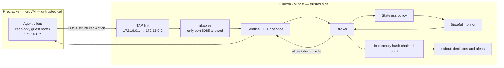

# Deterministic Sentinel — AI-swarm containment PoC
Repo that creates a deterministic sentinel for probabilistic AI swarms.

A proof of concept for the idea: **put a guard on the sandbox.** Today most
agent sandboxes are a wall with no sentinel. Here the agents run in a
Firecracker microVM (the "cell") and a separate, trusted **sentinel** is the single door
every action must pass through. The sentinel's decisions are **deterministic** —
no LLM, no persuasion, same input → same decision, every decision explained by
the name of the rule that fired.

The design follows the lesson from the July 2026 OpenAI eval escape, where
models broke out through the *one permitted egress channel* (a package-registry
proxy with an SSRF gap): an allowlist is necessary but not sufficient. So the
sentinel adds stateful, swarm-aware checks on top of the allowlist.

> **Safety note.** Action requests perform no real file, tool, or outbound
> network effects and contain no exploit. The microVM launcher configures a
> local TAP/firewall, and the agent sends action records to the host sentinel.
> The "attacks" remain abstract action records, not working attack code.

## Architecture



The guest has one network interface and no default route. The host firewall
drops guest traffic except requests to the sentinel. The broker first applies
the per-action policy, then the stateful monitor, and returns a named rule with
every decision. An `allow` is only a decision: this PoC has no trusted adapter
that performs the requested file, tool, DNS, or outbound network effect.

The sentinel prints audited decisions and escalation alerts to stdout. The
audit chain lives in memory and is lost when the process exits. The boot test
captures host and guest console output in a temporary file, prints it on
failure, and deletes it on exit; there is no persistent log store yet.

## Layers

| Layer | File | Job |
|---|---|---|
| Action vocabulary | `sentinel/actions.py` | Agents touch the world only via typed `Action`s (a finite action calculus). No raw sockets/files/subprocess. |
| Deterministic policy | `sentinel/policy.py` | Allow/deny of a single action in isolation. Default-deny, per-agent capabilities, exact-host allowlists, canary paths. Outside the model. |
| Stateful monitor | `sentinel/monitor.py` | What the policy can't see: cumulative **budgets** (per-agent **and** per-swarm), **taint** tracking, **provenance**, **swarm correlation**. Can only make a decision *stricter*. Fails closed. |
| Broker | `sentinel/broker.py` | The single enforcement point. Complete mediation: policy → monitor → allow/deny, with an audit log. |
| HTTP front end | `sentinel/serve.py` | Same broker as a stdlib HTTP service on the Linux host. |

## What it catches (and how)

| Pattern | Research analogue | Rule that fires |
|---|---|---|
| Send secret straight out | basic exfiltration | `egress-allowlist` |
| Abuse the one *permitted* host | OpenAI/HF proxy escape | `budget-agent` / `budget-swarm` |
| read → transform → send to an **allowlisted** host | Agentic Reference Monitor (laundering) | `taint-egress` |
| Smuggle bytes in DNS names | covert channel | `dns-allowlist` |
| Agent A probes, agent B sends | multi-agent split role | `corr-split-role` |
| N agents each send a slice | distributed exfiltration / collusion | `corr-split-payload` |
| Touch a honeytoken | canary tripwire | `canary-tripwire` (hard kill) |

## What happens on detection

Detection and *response* are separated so the reaction is a reviewed setting
(`sentinel/response.py`), not hard-coded. A deny always blocks the action first;
on top of that, a `ResponsePolicy` maps the rule that fired to an escalation:

| Mode | Effect |
|---|---|
| `DENY_ONLY` | block this action; the agent keeps operating |
| `KILL_AGENT` | block + permanently deny every future action from this agent |
| `QUARANTINE_SWARM` | block + freeze the **whole cell** (`swarm-quarantined`), pending human review |

Any escalation also emits an `Alert` to an out-of-band sink (a human/SIEM) — in
the demo it prints `!! ALERT [...]`. Two presets: `ResponsePolicy.preserve_original()`
(taint/canary kill the agent) and `ResponsePolicy.strict()` (a confirmed leak
quarantines the cell).

The audit log is **hash-chained** (`AuditLog`): each entry commits selected
action and decision fields to the previous hash. `audit.verify()` detects
changes to those committed fields. It is in memory only; durable, out-of-band
storage would be needed for a production audit trail.

## Run

```bash
cd sentinel-poc
python3.13 run_demo.py        # swarm demo + response-on-detection + chain verify
python3.13 test_sentinel.py   # 19 tests  (or: pytest)
```

## Six AI agents and six tools

The local demo now creates six `AIAgent` instances with distinct roles:
researcher, writer, analyst, reporter, resolver, and coordinator (`agent-1`
through `agent-6`). The HTTP service grants the same six identities.

| Tool | Sentinel action |
|---|---|
| `read_file` | `file_read` |
| `write_file` | `file_write` |
| `run_python` | `tool_exec` (python only) |
| `send_result` | `net_send` |
| `resolve_host` | `dns_resolve` |
| `publish_message` | `bus_publish` |

`swarm/ai_agents.py` provides the model interface and tool registry. Every tool
call goes through `Broker.submit`, including provenance supplied in
`ToolCall.derived_from`. Tools submit abstract intents and do not execute real
effects. The six tools wrap the existing action vocabulary; only `python` is
an allowed tool binary.

The default `OfflineModel` is a scripted simulation, **not a live LLM**. To
integrate a model, implement `propose(role, task) -> list[ToolCall]` and pass
that backend to `build_ai_agents(model)`. The model proposes actions; the
sentinel remains deterministic and retains sole authority to allow or deny.
No provider, API credentials, or external model transport is bundled. The
microVM client still runs its existing three-action mediation smoke test.

## Firecracker microVM deployment

This deployment needs a **Linux host with KVM** and the Firecracker binary. It
cannot boot directly on macOS. Obtain a compatible guest kernel image from the
[Firecracker releases](https://github.com/firecracker-microvm/firecracker/releases)
for the host architecture. On a Debian/Ubuntu Linux host, install `debootstrap`,
`e2fsprogs`, `iproute2`, `nftables`, and `coreutils`, plus Python 3.13 on the host, then
build a Debian Trixie guest image:

```bash
cd sentinel-poc
sudo deploy/microvm/build-rootfs.sh /path/to/agent.ext4
sudo KERNEL_IMAGE=/path/to/vmlinux ROOTFS_IMAGE=/path/to/agent.ext4 \
  deploy/microvm/run.sh
```

To run the boot integration test on that Linux/KVM host, build a fresh guest
image from the current source, then run:

```bash
cd sentinel-poc
sudo KERNEL_IMAGE=/path/to/vmlinux ROOTFS_IMAGE=/path/to/agent.ext4 \
  deploy/microvm/test-boot.sh
```

The test boots the guest, waits up to 120 seconds, and checks that two benign
actions were allowed and an external-host send was denied by
`egress-allowlist`. The guest prints `SENTINEL_BOOT_TEST_PASS` only after all
three responses match. The test exits 77 with `SKIP` on hosts without Linux
KVM. It has not been run on this macOS development machine.

The rootfs builder downloads Debian packages. The launcher creates one TAP,
one dedicated nftables table, and a temporary VM config, then removes them on
exit. It refuses to replace an existing TAP or firewall table. Inspect the
scripts before running them as root. The guest rootfs is mounted read-only;
the guest agent runs as UID 10002. For a production deployment, run Firecracker
under its **jailer** with a dedicated unprivileged host user and appropriate
resource limits, following the [Firecracker host guidance](https://github.com/firecracker-microvm/firecracker/blob/main/docs/prod-host-setup.md).

- The guest has one NIC, a static address (`172.16.0.2`), and **no default route**.
- Host firewall rules allow guest traffic only to the sentinel on
  `172.16.0.1:8085`; guest forwarding is denied even if the guest changes routes.
- The sentinel runs on the Linux host, outside the guest, and has no third-party
  Python dependencies. Its HTTP service returns decisions only; it does not
  perform approved file, tool, DNS, or network effects.

## Honest limits (what a reviewer will ask)

1. **The microVM launcher is a PoC, not a hardened host setup.** Firecracker
   provides a guest kernel boundary, but the launcher does not use the Firecracker
   jailer or set host resource limits. The host kernel, KVM, and firewall remain
   part of the trust boundary. The sentinel is outside the guest.
2. **Deterministic means it only catches what you specified.** The correlation
   rules here (split-role, split-payload) are illustrative; a real deployment
   needs a tuned, reviewed catalogue and will still miss novel patterns. The
   intended design pairs this deterministic enforcer (final authority) with an
   optional LLM analyzer that sits **off the critical path** and may only
   *propose stricter* rules or flag for a human — never loosen policy.
3. **Taint tracking is only as good as the provenance signal.** Here agents
   declare `derived_from`; in production you need the adapter to attach
   provenance so the agent can't simply omit it.
4. **The sentinel must stay simpler than what it guards.** The current host
   launcher starts the stdlib-only sentinel and Firecracker as root and does
   not persist audit logs. A production host needs privilege separation,
   Firecracker's jailer, and durable logging.
